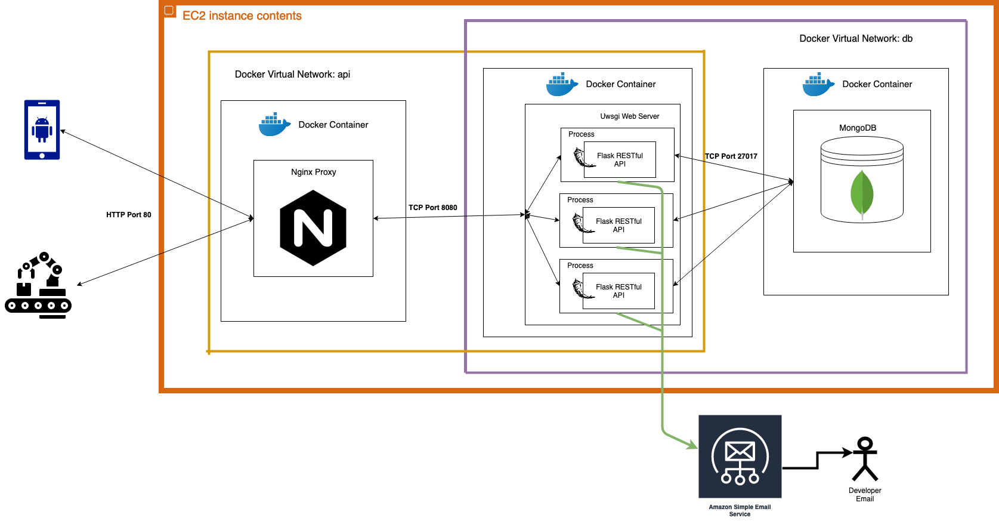

# A Taste of Heaven

## Table of Contents

- [A Taste of Heaven](#a-taste-of-heaven)
  - [Context](#context)
    - [Problem](#problem)
    - [Goals](#goals)
  - [Source File Structure](#source-file-structure)
    - [REST API](#rest-api)
    - [NGINX](#nginx)
    - [Android Phone Application](#android-phone-application)
    - [MongoDB](#mongodb)
  - [Deployment](#deployment)
  - [Infrastucture Design Schematic](#infrastucture-design-schematic)

## Context

### Problem

This is a web-based drink ordering system. Large-scale events tend to have long lines to purchase drinks. These long lines ruin an attendee’s experience of the event and reduce the number of sales that could be made. In order to reduce the wait time and increase sales, a capstone project to create a mixed drink dispenser was started. Coupled with this mixed drink dispenser is a phone application that will allow users to create an account, make a custom drink and order it all through their mobile device.

### Goals

This Android application requires cloud services for communication between the user and the drink dispensing machines. This will facilitate communication with the microcontroller on the dispensing machine through the onboard micro computer. Additionally, this software is designed in order to accommodate for multiple drinking machines that can be deployed at multiple events.

## Source File Structure

### REST API

The API consists of a Flask python API, the Source code can be viewed in the API/ folder. The logs of the application are placed in the API/logs folder they are also a volume to the container of the application. The Docker container containing the Flask source code is running it on a UWSGI web server the configuration file of this web server can also be found in the API/ folder.

More information can be found in the API/README.md file.

### NGINX

The NGINX instance is used as a proxy to the UWSGI webserver running the Flask RESTapi. The config and dockerfile can be found in the Nginx/ folder.

### Android Phone Application

The Andorid Phone Application source code can be found under /App folder. It will automaticly connect to the cloud instance when build and deployed to an android phone.

### MongoDB

The mongoDB is deployed using docker and docker-compose, the container is defined in the docker-compose.yml file.

## Deployment

It is possible to deploy this project on a local machine. To do this you will need:

- Android Studio
- Docker
- Docker-Compose

1. Use Android studio to build the phone application a run it on your device.
2. Run the build.sh script, that uses docker, to build the docker images needed.
3. run ```docker-compose up``` to deploy the cluster on your machine. Dont forget to create the apropiate .env files following the structure of the .env.example file.

## Infrastucture Design Schematic


